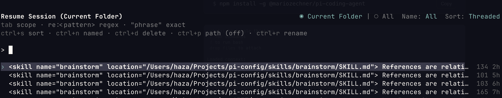
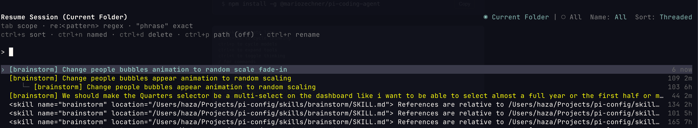
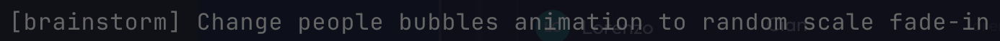

# pi-smart-sessions

[](https://www.npmjs.com/package/pi-smart-sessions)

A [Pi](https://github.com/badlogic/pi) extension that automatically names your sessions with AI-generated summaries. No more scrolling through a wall of skill tags in your session list.

## Before

Every skill session looks the same — impossible to tell them apart:



## After

Each session gets a short, meaningful name:



The name is a skill prefix plus a 5–10 word summary of your prompt:



## How it works

1. Detects when you start a session with `/skill:name your prompt here`
2. Immediately sets a temporary name with the first 60 characters
3. Calls a cheap model (Codex mini → Haiku → current model) to summarize your prompt in 5–10 words
4. Updates the session name with the AI summary, prefixed by the skill name

The summarization happens in the background — no delay to your workflow. If the model call fails, the truncated name is kept as a fallback.

## Install

```bash
pi install npm:pi-smart-sessions
```

Or try it without installing:

```bash
pi -e npm:pi-smart-sessions
```

You can also install from git:

```bash
pi install git:github.com/HazAT/pi-smart-sessions
```

## Tips

- **Existing sessions** can be renamed manually with **Ctrl+R** in the session selector
- The extension only names the first skill-based prompt per session — it won't overwrite names you set yourself
- Works with any skill, not just brainstorm

## License

MIT
